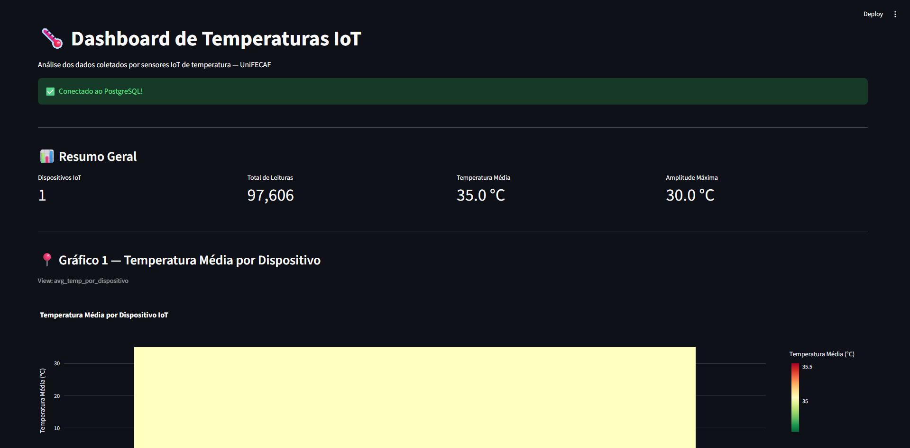
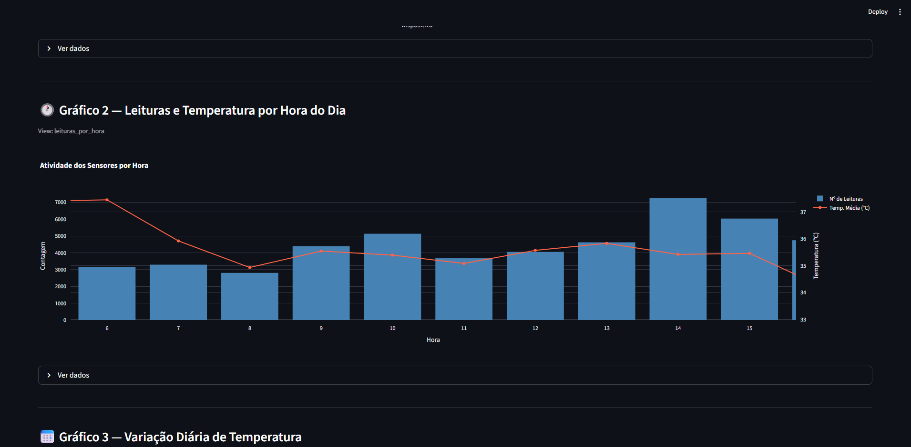
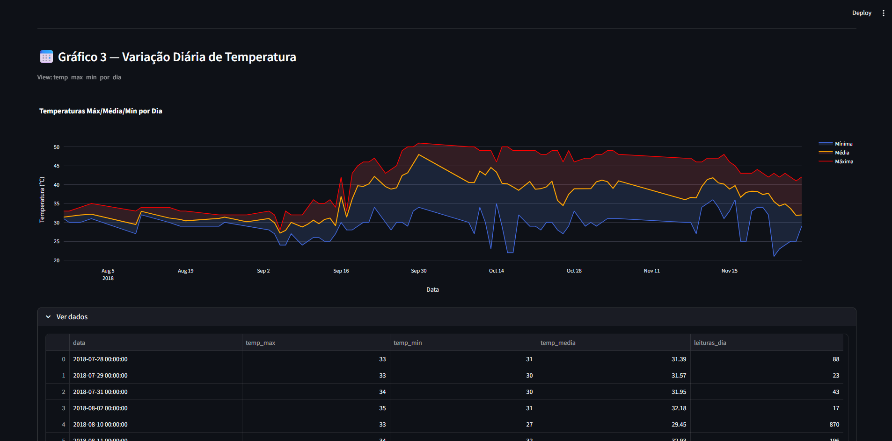

# IOT Pipeline

This project builds an end-to-end data pipeline using real temperature sensor readings available on <a href="https://www.kaggle.com/"><code>Kaggle</code></a>. The goal is to demonstrate how to transform raw IoT data into actionable visualizations and insights, following a simple and reproducible architecture.

#### HOW TO EXECUTE

1. <strong>Create the Python virtual environment</strong>: <code>python -m venv venv
   </code>
2. <strong>Install the dependencies</strong>: <code>pip install -r requirements.txt</code>
3. <strong>Deploy the database using Docker</strong>: <code>docker compose up -d</code>
4. <strong>Enter the information into the database</strong>: <code>python src/ingest.py</code>
5. <strong>Open the dashboard</strong>: <code>python -m streamlit run src/dashboard.py</code>

#### DEPENDENCIES

- Docker
- Python
- Stremlit
- Plotly
- SQL ALchemy

#### PREVIEW

#### COPYRIGHT

Project developed exclusively by  
<strong>Salutx.</strong>, Lucas Matos.
